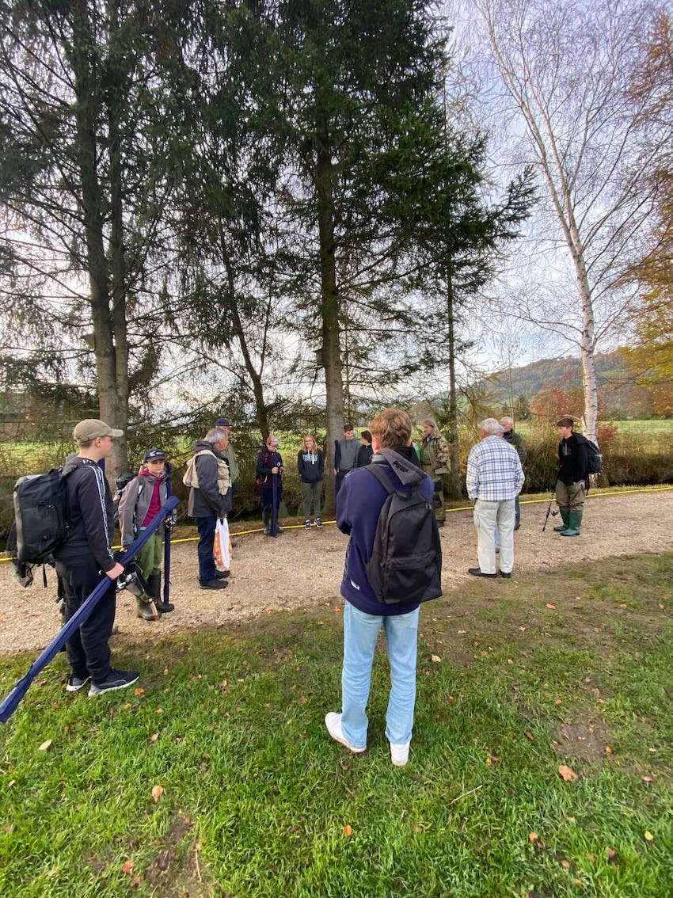
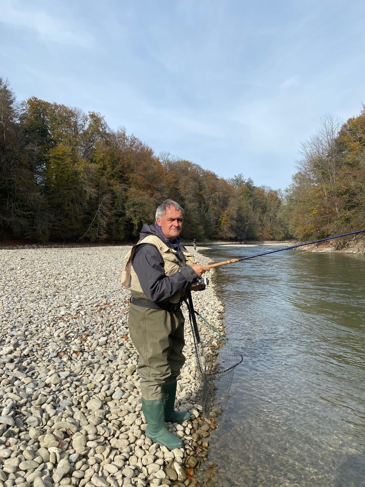
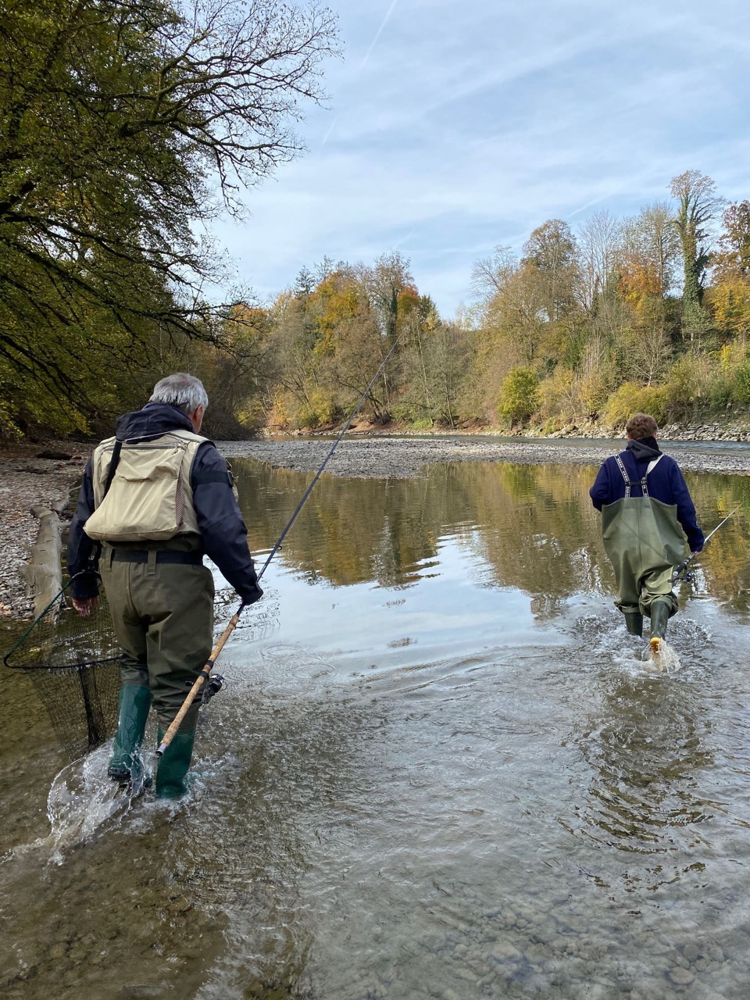
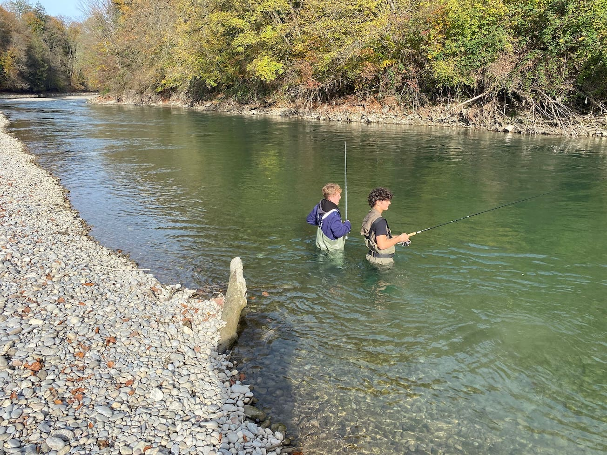
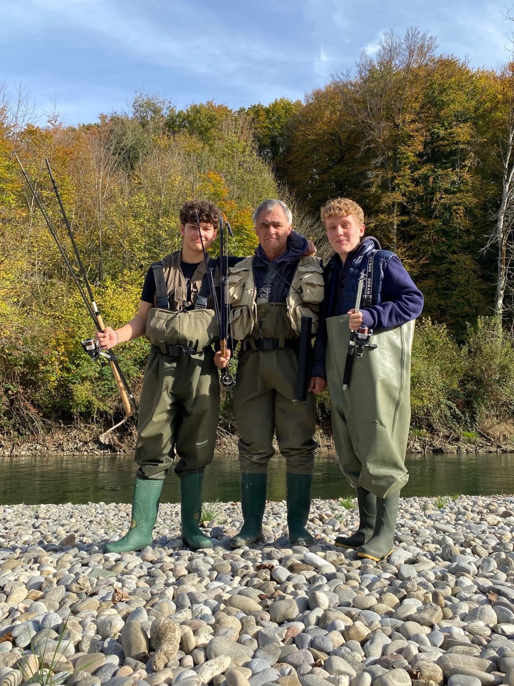

+++
title = "Wenn die fröhliche Melodie erstickt"
date = "2022-12-01"
draft = false
pinned = false
image = "fisch.jpeg"
footnotes = "**Die Autoren:** Xeno Messmer, Corsin Casty"
+++


## Wie der Klimawandel die Bestände unserer kälteliebenden Fischbestände in der Aare schrumpfen lässt - der aussichtslose Kampf des Fischereivereins Aaretal



### Petri Heil

Die lebhafte Melodie von Schuberts “Forelle” ist eine ausgezeichnete Metapher für die Stimmung an jenem kühlen Septembermorgen an der Aare. Joachim Guthruf und seine Anglerfreunde vom Fischereiverein Aaretal haben uns (Corsin und Xeno) zum Äschenfischen nach Münsingen eingeladen. Obwohl die Wassertemperatur einige Grade über der normalen Monatstemperatur liegt, versuchen die Hobby-Fischer ihr Glück. “Petri-Heil” wünscht uns Fischer Joachim und wir schlenzen die zuckende Bienenmade, befestigt am Haken unserer Spinnrute, in die strömende Aare. Während wir mit Gummistiefel, und Wathosen durchs Flussbecken waten, fällt uns auf, dass die Wassertemperatur tatsächlich wärmer ist als erwartet. Statistiken zeigen einen klaren durchschnittlichen Temperaturanstieg seit den 1970er-Jahren. Dieser Anstieg von Rund 1.5 Grad Celsius hat im Sommer einen negativen Einfluss auf Kaltwasserfische wie Forelle, Äsche und Trüsche. Obwohl erst ab 25 Grad Celsius akute Todesgefahr herrscht, wird es bereits ab 23 Grad stressig für die kälteliebenden Spezies. Beim Fischbestand der Äsche sind 85% der Fische männlich. Experten vermuten, dass eine Korrelation zwischen Temperaturzunahme und dem prozentualen Anteil von männlichen Äschen besteht.

Während ein kleiner Specht am gegenüberliegenden Ufer auf einen Stamm einhämmert, hört man einen grellen Schrei „ I HA EINE!“. Fischer Carlo kurbelt eifrig die Schnur seiner Rute ein und sein Kumpel greift nach dem Kescher. Am Ende der Schnur hängt ein bemitleidenswerter, winziger Wels. Die Enttäuschung ist Carlo ins Gesicht geschrieben. Joachim erklärt uns, dass nicht nur die Grösse des Fisches, sondern auch die Art für Ernüchterung sorgte. Fischarten wie der Wels profitieren vom Temperaturanstieg, denn sie können sich unter diesen Umständen besonders gut fortpflanzen. Der Wels wird demnach immer häufiger. Obschon der Fischerverein vermehrt Jungfische aussetzt, fallen die Fangzahlen von Kaltwasserfischen von Jahr zu Jahr, erzählt uns Joachim. Bei den Bachforellen liegt es nicht etwa an der natürlichen Fortpflanzung, sondern viel mehr daran, dass die Fische den ersten Sommer nicht überleben. Durch den übermässigen Gebrauch von Pestiziden in der Landwirtschaft, gerät Dünger in die natürlichen Gewässer und führt zu einem klebrigen, vermoosten Boden. Dieser nährreiche Boden verursacht die Zerstörung der Laichplätze von Bachforellen und Äschen. Seit dem Aufschwung gegen die Jahrtausendwende erleben wir vor allem im Mittelland einen progressiven Rückgang der kälteliebenden Fischbestände.



### Dr. Joachim Guthruf

Joachim G. ist in Burgdorf aufgewachsen und begann ein Biologiestudium in Bern. Später entschied er sich, das Studium für Gewässerbiologie an der EAWAG / ETH bei Zürich fortzusetzen. Er schrieb dort seine Dissertation über die Äsche, seinen Lieblingsfisch. Joachim ist seither Mitarbeiter beim Umweltbüro Aquatica GmbH in Wichtrach und untersucht häufig Gewässer mit schwindenden Fischbestände. Er ist ausserdem Leiter der Jugendgruppe Fischereiverein Aaretal und ist seit Kindheitsjahren ein begeisterter Hobbyfischer.



### Der Erstickungstod

Das wunderbare türkis-grüne Wasser der Aare erweckt den Anschein eines gesunden Ökosystems. Der Betrachter wird aber getäuscht. Die knallharte Realität ist, dass sich mit erhöhten Gewässertemperaturen auch die Parasiten im blauen Reich verbreiten. Die proliferative Nierenkrankheit trete bei den Forellen und Äschen in den Sommermonaten besonders häufig auf, erzählt uns Joachim. Befallene Fische sind leicht erkennbar, denn sie wirken teilnahmslos und beim Sezieren sieht man deren grau verfärbte Niere. Die Niere, das wichtigste blutbildende Organ der Fische, kann durch den Parasiten weniger rote Blutkörperchen bilden. Dies führt zu einer Blutarmut, doch die Gewebe erhalten noch knapp ausreichend vom essenziellen Sauerstoff. Mit dem zusätzlichen Wärmeanstieg sinkt die Löslichkeit von Sauerstoff im Wasser. Dies führt zu einer zusätzlichen Sauerstoffknappheit. Die bittere Folge: der Erstickungstod. «Hunderti erstickti Fische hani gseh i dem Summer», beklagt sich unser Fischerfreund Carlo sichtlich aufgewühlt nach Joachims biologischer Erklärung des Fischsterbens. Wie uns Joachim im Interview genau erklärt, sterben im ersten Lebensjahr bis zu 80% der jungen Forellen an dieser Krankheit.

### Die Nachhaltigkeit der Wasserkraft

Nach einer kurzen Verpflegungspause in der Vereinshütte begeben sich die rund 20 Fischer/innen wieder ans Ufer, diesmal mit deutlich weniger Euphorie als in der Früh. Ausser dem untermässigen Wels wurde kein einziger Fisch gefangen. Auch die vielen Wasserkraftwerke der Schweiz, stellen eingrosses Problem für die Fische dar. Das Potenzial der Wasserkraftwerke ist bereits zu über 95 Prozent ausgeschöpft und trotzdem würden viele Investitionen vom Bund finanziert werden, um die autonome Energieversorgung in der Schweiz zu gewährleisten. 58 % unseres erzeugten Stroms wurde 2020 durch Wasserkraftwerke erzeugt. Auch wenn Wasserkraftnutzung kein CO2 ausstösst und nachhaltig ist, kann sie die Natur beeinträchtigen. Wasserkraftwerke blockieren Laichrouten von gewissen Arten und ganze Fischschwärme können vernichtet werden. Die Fische können in die Turbinenpassage geraten und dort elendiglich verenden. Etwa 50 Meter flussaufwärts vom Flussbett, in welchem wir seit Stunden aufgespiesste Maden auswerfen, sind Kanalisierungsarbeiten im Gange. Die Kanalisierung der Aare steht in den letzten Jahren stark in der Kritik. Je stärker der Klimawandel fortschreitet, desto mehr muss man das Gewässer aufgrund der Hochwassergefahr durch Aufweitung und die Schaffung von Saitenarmen renaturieren. Fische sind dringend auf ein natürliches Habitat angewiesen. Denn nur dort können sie laichen, fressen und überwintern ohne gestört zu werden.

Der Lärm, den die schweren Maschinen verursachen, ist nervenzehrend und in unseren überdimensionalen Wathosen wird uns allmählich heiss. Es bleibt nur übrig zu hoffen, dass sich der Hochwasserschutz und die Renaturierung sowohl für die Menschen als auch für die Fische lohnen. Joachim, der beharrlich an derselben Stelle fischt, murmelt vor sich hin «An das muss man sich wohl auch in Zukunft gewöhnen». Früher habe es Tage gegeben, an denen er bis zu sechs Fische aus der Aare gezogen habe. Heute seien es nur noch selten welche. Wie uns eine Fischerin erklärt, sei heute ein guter Angeltag, denn der Mond sei abnehmend. Anscheinend gibt es einen Zusammenhang zwischen Fangerfolg und zunehmendem Mond. Auf Nachfrage kann uns Joachim diese Theorie auch nicht wirklich erklären.



### Wasserkraft und Erhaltung von Restwassermengen

In der Schweiz stammen 58% des produzierten Stroms aus der Wasserkraft. Das sind insgesamt ca. 37‘000 Gigawattstunden Strom pro Jahr. Mit dieser Menge an Strom kann man etwa 100‘000 Glühbirnen für ca. 7‘000‘000 Stunden brennen lassen. Die Wasserkraftnutzung hat aber auch gravierende Auswirkungen auf die Aare und natürlich auch auf andere Flüsse und ihre Fische. Z.B brauchen gefährdete Fische wie die Forellen einen lockeren Kiesboden um zu laichen. Forellen brauchen eine 20cm tiefe Grube, um ihren Laich zu vergraben. Durch Verbauungen schwinden solche Laichplätze, da das weniger schnell fliessende Wasser den Boden nicht genügend auflockert und er sich dadurch verhärtet. Restwassermengen spielen dabei eine entscheidende Rolle, da bei zu geringem Restwasser Lebensräume verloren gehen und sich das Wasser stärker erwärmt. Doch National- und Ständerat erliessen zur Reduktion der Stromknappheit eine Verordnung, mit der die gesetzlich geltenden Restwassermengen befristet reduziert werden können.

Noch schlimmer ist, dass in mehreren Kantonen die Restwasserbestimmungen aus dem Jahr 1991 noch immer nicht vollzogen sind und zahlreiche Gewässer ohne Restwasser sind.



### Der unerbittliche Kampf

Kurz vor Mittag stöhnt ein Jungfischer: «Ich habe keine Lust mehr! In diesem Gewässer fängt man eh nichts». Wir können sein Gejammer nachvollziehen, denken jedoch nicht ans Aufgeben. Auch der Fischereiverein Aaretal denkt nicht daran, den Kampf für naturnahe Gewäässer und Fischbestände aufzugeben. Der Verein plant eine Revitalisierung in einem Bach, in der Nähe des Vereinlokals. Anschliessend sollen regelmässige Abfischungen durchgeführt werden, um die Entwicklung des Fischbestandes nach der Revitalisierung zu evaluieren. Bei diesem kleinen Projekt kann man viel zur Revitalisierung für zukünftige Projekte lernen. Die Arbeit des Fischervereins ist nicht zu unterschätzen, denn er setzt sich für unzählige Umweltprojekte ein. Joachim ist überzeugt, dass es sehr wichtig ist, die Allgemeinheit über die Klimaerwärmung und den Rückgang der Fischbestände zu informieren. Der Verein bemüht sich aktiv für einen starken Umweltschutz. Ohne politische und

finanzielle Möglichkeiten sind ihre Aktionen jedoch beschränkt. Joachim meint, dass wir alle unseren Teil für den Klimaschutz beitragen sollen, sei es weniger Autofahren oder einmal weniger in die Karibik zu fliegen. Joachim findet, dass wir unser politisches System in der Schweiz mehr ausnützen sollten und ruft auf, wählen zu gehen. Die direkte Demokratie, welche es in vielen Ländern nicht gibt, sei eine Möglichkeit, wirklich etwas zu verändern. Massnahmen wie die Reduktion der Restwassermengen, die Einengung des Gewässrraums sowie der Einsatz von Pestiziden seien zweckwidrig, meint Joachim im Interview. In Zukunft wird es wohl darauf ankommen, dass der Klima- und Gewässerschutz stärker gefördert werden muss, ohne die Finanzen zu vernachlässigen. Es sei sehr wichtig für die Unterwasserwelt, dass alle sich bemühen und auf den ökologischen Fussabdruck achten. «Es liegt an uns», appelliert Joachim an die Schweiz.

### Der letzte Auswurf

Während dem Abendessen erzählen die erfahrenen Fischer alte Geschichten. Wie sie «riesige Püderforellen» überwältigten, damals, als alles noch besser war. Das Fischerlatein ist in den Geschichten nicht zu überhören, dennoch sind sie äusserst unterhaltsam. Die Jungen hören gebannt zu. Die Fischer, die noch Energie haben, gehen nach dem Abendessen noch einmal ans Wasser.

Wir finden, dass dieser Verein wirklich eine tolle Gemeinschaft ist, bestehend aus allen Gesellschaftsschichten, verbunden durch ein immer schwieriger werdendes Hobby; das Aarefischen. Einen wunderbaren Sport mitten in der Natur, bedroht durch uns Menschen. Wohl oder übel müssen auch wir kurz vor Sonnenuntergang ein letztes Mal unseren Köder gegen die Strömung der Aare auswerfen. Alle Fischer, die ihre Ruten und Fischutensilien weggeräumt haben, schauen uns bei unserem letzten Auswurf gebannt zu. Eine einsame Bachforelle, die sich irgendwie an unseren spitzen Haken verirrt, hätte uns gereicht. Doch der Biss bleibt aus. Die fröhliche Melodie der Forelle ist wohl letzten Sommer erstickt.

